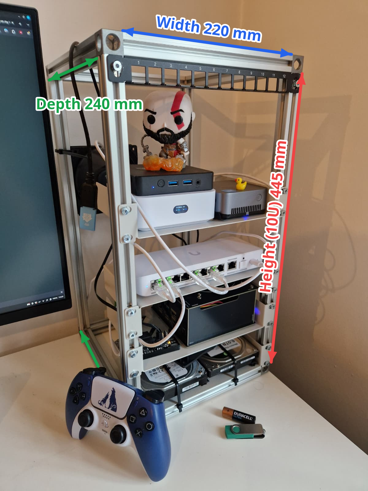

# mini-rack

The hardware behind [erasmus.works](https://github.com/ErasmusAndre/erasmus.works):
a custom-built 10-inch aluminium mini rack, 3D printed mounts and mains
distribution, and the mini-PCs running my Talos Kubernetes cluster.

<table>
<tr>
<td width="50%"></td>
<td width="50%"></td>
</tr>
</table>

---

## The Rack

2020 aluminium extrusion, 10U, 220 mm wide and 240 mm deep.

*PS5 controller, AA battery and USB stick for scale.*

### Parts

| Qty | Part | Price |
| --- | --- | --- |
| 4 | [Profile 20x20 B-type slot 6](https://www.motedis.nl/en/Profile-20x20-B-type-slot-6), 1 m lengths | €23.00 |
| 8 | [Cube connector 20 B-type slot 6](https://www.motedis.nl/en/Cube-connector-20-B-type-slot-6), 3D variant | €33.00 |
| 40 | [Roll-in T-slot nut, slot 6, M5](https://www.aluxprofiel.nl/inklikmoer-t-sleuf-6-m5/a3665), 4 per U | €10.00 |
| 40 | [Flanged button head screw DIN 7380F, M5x8](https://www.motedis.nl/nl/Flensbout-DIN-7380F/M5x8), one per T-nut | €9.00 |
| | **Total** | **€75.00** |

#### Notes on the Parts:

Slot 6 throughout, which is the common choice at this profile size and carries by
far the widest range of T-nuts and connectors. 
Note: Slot 5 profile and connectors are not interchangeable with these.

Take the 3D connectors, not 2D: every corner of a cuboid frame joins three
profiles. They ship with DIN965 M6x16 countersunk screws, one per profile.

The T-nuts roll into an assembled frame, so mounting points can be added later
without taking the rack apart. Order spares, they are 20 cents each. M5 here is
the nut thread and is unrelated to the profile's M6 core.

The flange spreads load across the slot edges, so no washer is needed in normal
use. M5x8 suits 3 to 5 mm printed parts. For thinner mounts such as 1.5 mm steel
shelves, add a washer or drop to a 6 mm bolt, otherwise the screw bottoms out
before it clamps.

### Cut list

Twelve pieces out of the four 1 m lengths:

| Qty | Length | Axis |
| --- | --- | --- |
| 4 | 220 mm | Width |
| 4 | 240 mm | Depth |
| 4 | 445 mm | Height |

A rack unit is 44.5 mm, so height is `44.5 x U`. This build is 10U: 44.5 x 10 = 445 mm.

Two 445 mm pieces come out of each of the first two lengths, four 240 mm out of
the third, four 220 mm out of the fourth. That is 3620 mm cut from 4000 mm, so
there is room for saw kerf and a mistake.

Depth is a free choice. 240 mm clears the mini-PCs used here with room for cabling
behind them.

<!-- TODO: rack ears and patch panel mounting. -->

## 3D Printed Parts

<!-- TODO: one row per part: what it mounts, filament, and print settings.
     Both exports live in printed-parts/, same basename: rack-ear.step (AP242, from
     Onshape) next to rack-ear.3mf (slicer project, carries the print settings,
     so link it rather than retyping them). Add the public Onshape doc link.
     Ship the STEP where there is one: it is the file people can actually
     edit. CC BY-NC-SA does not require it. -->

| Part | Mounts | Material | Files |
| --- | --- | --- | --- |
| [Blackview MP-80 10 inch rack mount](printed-parts/blackview-mp80-10inch-rack-mount/) | K8s Node 2, 1U on the rails | PLA | [STEP](printed-parts/blackview-mp80-10inch-rack-mount/Blackview-MP80-10inch-Rack-Mount.step) · [3MF](printed-parts/blackview-mp80-10inch-rack-mount/Blackview-MP80-10inch-Rack-Mount.3mf) |
| [Blackview MP-80 mount](printed-parts/blackview-mp80-mount/) | K8s Node 2, shelf test mount | PLA | [STEP](printed-parts/blackview-mp80-mount/Blackview-MP80-Mount.step) · [3MF](printed-parts/blackview-mp80-mount/Blackview-MP80-Mount.3mf) |
| [Rack power module](printed-parts/rack-power-module/) | Mains distribution, 1U on the rails | PLA | [3MF, both variants](printed-parts/rack-power-module/README.md#files) |

## Power

One printed module per device, stacked down the back of the rack. Each carries a
C14 inlet, an illuminated DPST rocker and a C13 outlet, with a honeycomb shelf
behind the face plate for the device's mains adapter. A 30 cm C13 to C14 cord
links each module to the one below, so the stack chains off a single feed and
each rocker cuts its own module and everything downstream.

Two variants share the same face plate. **DIN rail** takes a normal two pin wall
plug on a length of DIN rail. **Power brick** goes straight into the brick's C14
inlet on a right angle connector. Stacked, the sockets alternate left and right,
which leaves room for an adapter taller than 1U.

Each module is 1U at the rails and costs €16 to €18 in parts.

<table>
<tr>
<td width="50%"></td>
<td width="50%"></td>
</tr>
</table>

This part carries live mains, which kills people who get it wrong. Do not build
it unless you are competent to wire mains and permitted to do so where you live.
Read [Safety](printed-parts/rack-power-module/README.md#safety) before you start,
and before you pick a filament.

Bill of materials, wiring diagram and build steps:
[Rack Power Module](printed-parts/rack-power-module/).

## Hardware

Compute currently in the cluster:

| Hardware | Model | CPU | Memory | Storage |
| --- | --- | --- | --- | --- |
| K8s Node 1 | MINIS FORUM UN1245 Mini-PC | Intel Core i5-12450H | 16 GB DDR4 | 512 GB SSD |
| K8s Node 2 | Blackview MP-80 | Intel Processor N97 | 16 GB DDR5 | 512 GB SSD |
| Home Assistant | BMAX B2 Pro | Intel Celeron N4000 | 8 GB DDR4 | 256 GB SSD |
| NAS | ODROID-H4+ | Intel Processor N97 | 16 GB DDR5 | 2 × 6 TB HDD |
| Router | UniFi Express 7 (UX7) | - | - | - |
| Switch | UniFi Flex 2.5G (USW-Flex-2.5G-8) | - | - | - |

---

## License

Star ⭐ this repo if you found it useful.

[CC BY-NC-SA 4.0](LICENSE). Use it, modify it, share it, as long as you credit
Andre Erasmus, link back to this repo, keep it non-commercial, and license
anything you share under the same terms.
