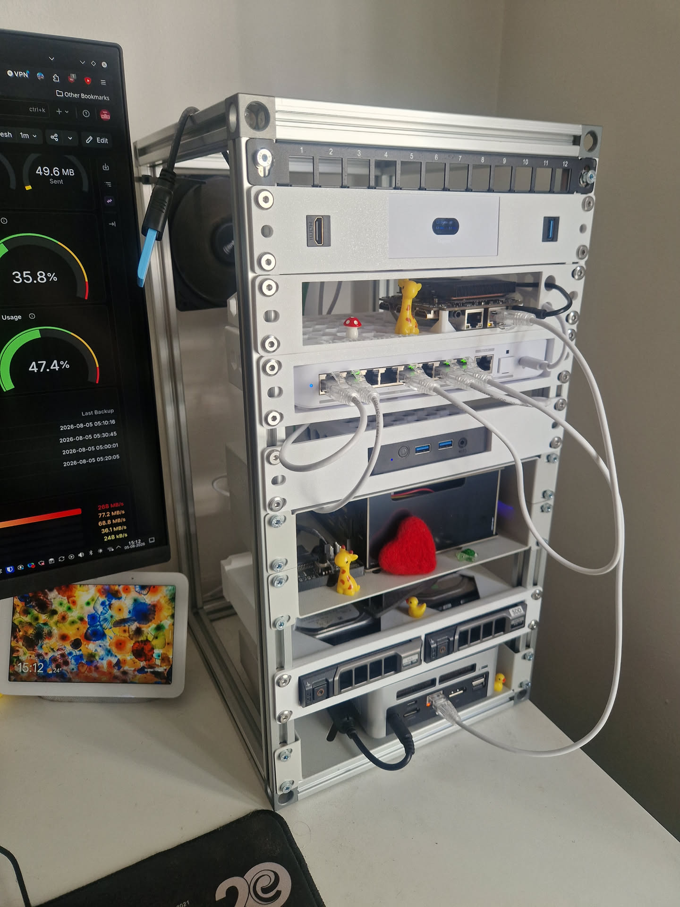

# mini-rack

The hardware behind [erasmus.works](https://github.com/ErasmusAndre/erasmus.works):
a custom-built 10-inch aluminium mini rack, 3D printed mounts, and the mini-PCs
running my Talos Kubernetes cluster.

---

## The Rack

<!-- TODO: extrusion profile and lengths, corner/joining hardware, overall
     dimensions, rack unit height, and a photo of the finished build. -->

## 3D Printed Parts

<!-- TODO: one row per part: what it mounts, filament, and print settings.
     Both exports live in printed-parts/, same basename: rack-ear.step (AP242, from
     Onshape) next to rack-ear.3mf (slicer project, carries the print settings,
     so link it rather than retyping them). Add the public Onshape doc link.
     The STEP is not optional: CERN-OHL-S requires the Complete Source in the
     preferred form for modification, and a mesh is not that. -->

| Part | Mounts | Material | Files |
| --- | --- | --- | --- |
| [Blackview MP-80 mount](printed-parts/blackview-mp80-mount/) | K8s Node 2 | PLA | [STEP](printed-parts/blackview-mp80-mount/Blackview-MP80-Mount.step) · [3MF](printed-parts/blackview-mp80-mount/Blackview-MP80-Mount.3mf) |

## Hardware

Compute currently in the cluster:

| Hardware | Model | CPU | Memory | Storage |
| --- | --- | --- | --- | --- |
| K8s Node 1 | MINIS FORUM UN1245 Mini-PC | Intel Core i5-12450H | 16 GB DDR4 | 512 GB SSD |
| K8s Node 2 | Blackview MP-80 | Intel Processor N97 | 16 GB DDR5 | 512 GB SSD |
| Home Assistant | BMAX B2 Pro | Intel Celeron N4000 | 8 GB DDR4 | 256 GB SSD |
| NAS | ODROID-H4+ | Intel Processor N97 | 16 GB DDR5 | 2 × 6 TB HDD |
| Router | UniFi Express 7 (UX7) | - | - | - |
| Switch | UniFi Flex 2.5G (USW-Flex-2.5G-8) | - | - | - |

---

## License

Copyright © 2026 Andre Erasmus

[CERN-OHL-S v2](LICENSE). Use it, modify it, build and sell hardware from it,
as long as you pass on the complete source under the same licence.

Credit **Andre Erasmus, github.com/ErasmusAndre/mini-rack**.
