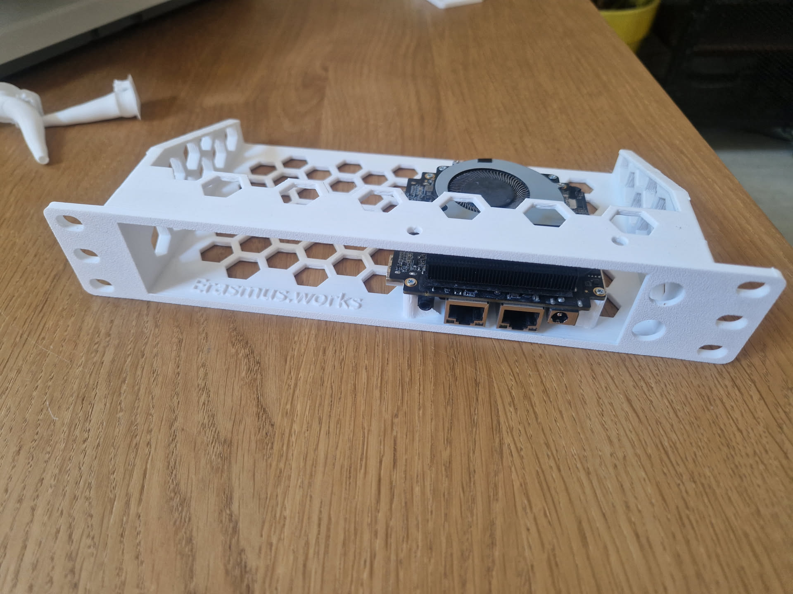

# Blackview MP-80 10 inch Rack Mount

A 1U 10-inch tray for the Blackview MP-80 (K8s Node 2) with its OEM enclosure
stripped off, printed in white PLA.

## Design notes

254 mm wide, 121 mm deep, 44.45 mm high. The ears bolt straight to the rack
rails, so the board no longer sits on a shelf. This is what the
[test mount](../blackview-mp80-mount/) was a trial run for: the same board
profile, now folded into a full-width tray.

The MP-80 does not go in the rack in its OEM enclosure. The board comes out of
the case and bolts to the tray instead. Outside the sealed plastic shell the
heatsink sits in open air, so the node runs cooler.

The hex cutouts in the floor and side wall let air through and cut print time.
The front panel carries an embossed erasmus.works.

## Printing

| | |
| --- | --- |
| Material | PLA, white |
| Profile | Anycubic Kobra X stock PLA |
| Nozzle | 0.4 mm @ 215 °C |
| Bed | 60 °C (PEI spring steel) |
| Layer height | 0.2 mm |
| Infill | 15 % |
| Supports | Tree |
| Orientation | Front panel face down on the bed |

## Hardware

| Qty | Part |
| --- | --- |
| 4 | Flanged button head DIN 7380F, M5x8, one per ear hole |
| 4 | Roll-in T-slot nut, slot 6, M5 |
| | The MP-80's own enclosure screws, salvaged when you strip the case |

## Files

| File | What it is |
| --- | --- |
| [`Blackview-MP80-10inch-Rack-Mount.step`](Blackview-MP80-10inch-Rack-Mount.step) | Source geometry, STEP AP242. Edit this. |
| [`Blackview-MP80-10inch-Rack-Mount.3mf`](Blackview-MP80-10inch-Rack-Mount.3mf) | Ready to slice and print. |

## License

CERN-OHL-S v2 ([LICENSE](../../LICENSE)), without warranty of any kind.
Source location: https://github.com/ErasmusAndre/mini-rack

Per CERN-OHL-S v2 section 4, hardware built from this source must keep the
source location visible on the outside where practicable.

Made by **André Erasmus, github.com/ErasmusAndre/mini-rack**.
