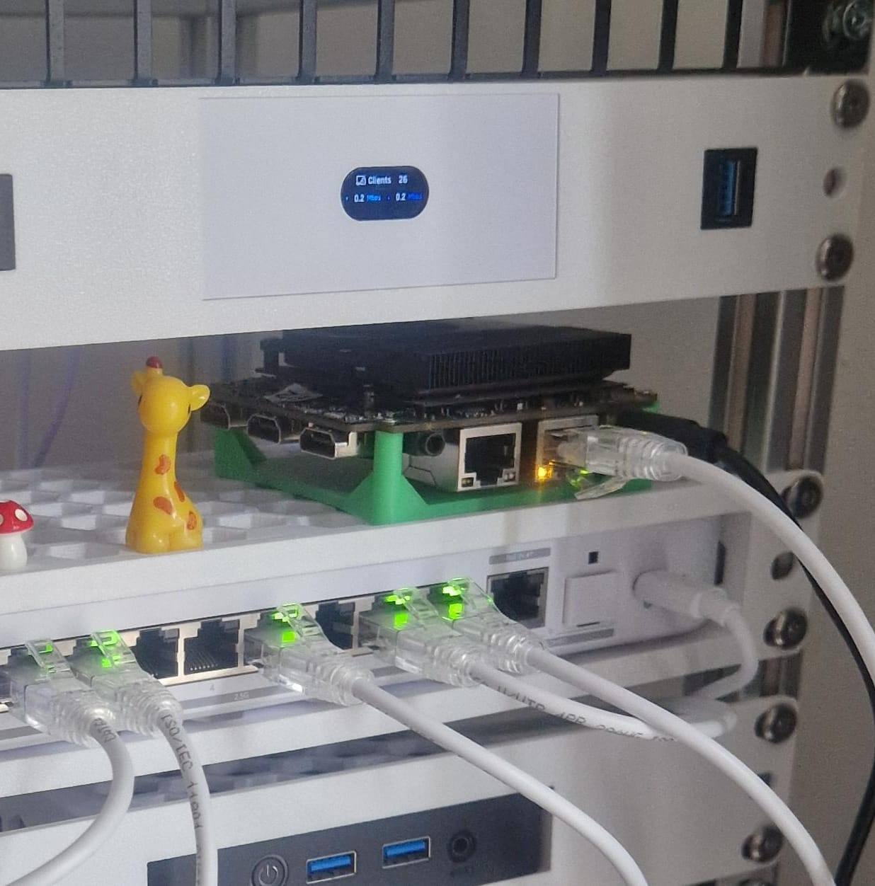

# Blackview MP-80 Mount

A stand for the Blackview MP-80 (K8s Node 2) with its OEM enclosure stripped
off, printed in green PLA.

## Design notes

This is a test mount, not a finished part. It holds the board steady on a shelf
and nothing more. The profile is meant to be folded into a larger print later,
such as a full 10-inch rack mount that screws down to the rails.

The MP-80 does not go in the rack in its OEM enclosure. The board comes out of
the case and bolts to this stand instead. Outside the sealed plastic shell the
heatsink sits in open air, so the node runs cooler, and without the case it
takes up much less room on the shelf.

The screws that hold the board down come from the OEM enclosure, so keep them
when you take the case apart. Nothing else is needed.

## Printing

It lays flat on its bottom face and prints without supports.

| | |
| --- | --- |
| Material | PLA |
| Profile | Anycubic Kobra X stock PLA |
| Nozzle | 0.4 mm @ 215 °C |
| Bed | 60 °C (PEI spring steel) |
| Layer height | 0.2 mm |
| Infill | 15 % |
| Supports | None |
| Orientation | Flat on the bottom face, as modelled |

## Hardware

The MP-80's own enclosure screws, salvaged when you strip the case. No other
fasteners.

## Files

| File | What it is |
| --- | --- |
| [`Blackview-MP80-Mount.step`](Blackview-MP80-Mount.step) | Source geometry, STEP AP242. Edit this. |
| [`Blackview-MP80-Mount.3mf`](Blackview-MP80-Mount.3mf) | Ready to slice and print. |

## License

Copyright © 2026 Andre Erasmus.

This source describes Open Hardware and is licensed under the CERN-OHL-S v2.

You may redistribute and modify this source and make products using it under
the terms of the CERN-OHL-S v2 (https://ohwr.org/cern_ohl_s_v2.txt).

This source is distributed WITHOUT ANY EXPRESS OR IMPLIED WARRANTY, INCLUDING
OF MERCHANTABILITY, SATISFACTORY QUALITY AND FITNESS FOR A PARTICULAR PURPOSE.
Please see the CERN-OHL-S v2 for applicable conditions.

Source location: https://github.com/ErasmusAndre/mini-rack

As per CERN-OHL-S v2 section 4, should You produce hardware based on this
source, You must where practicable maintain the Source Location visible on the
external case of any product you make using this source.
