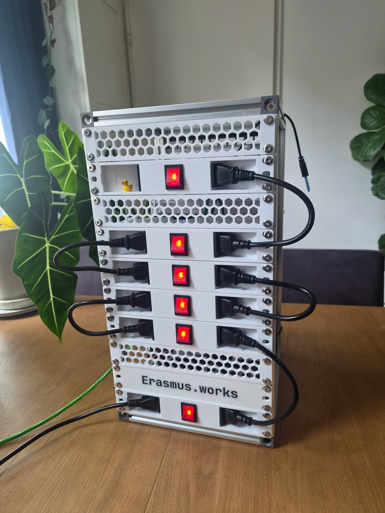
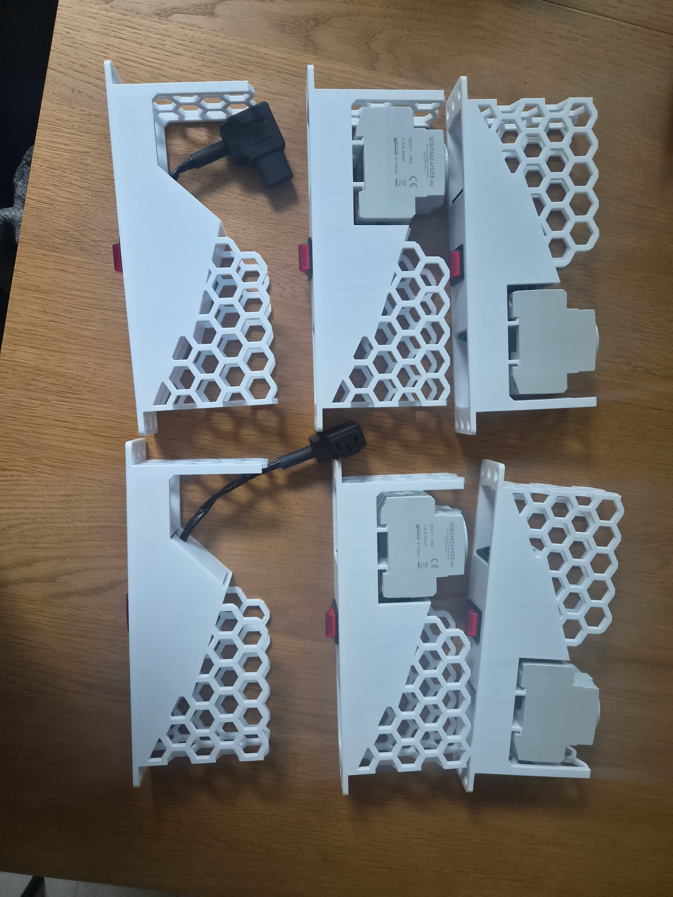
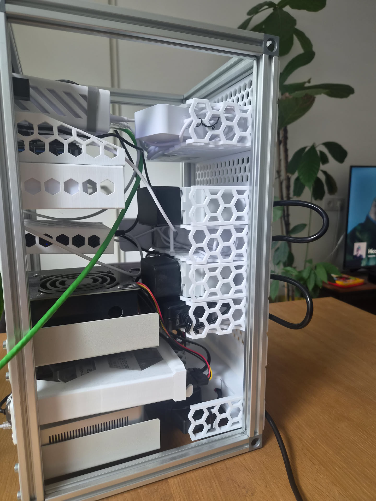
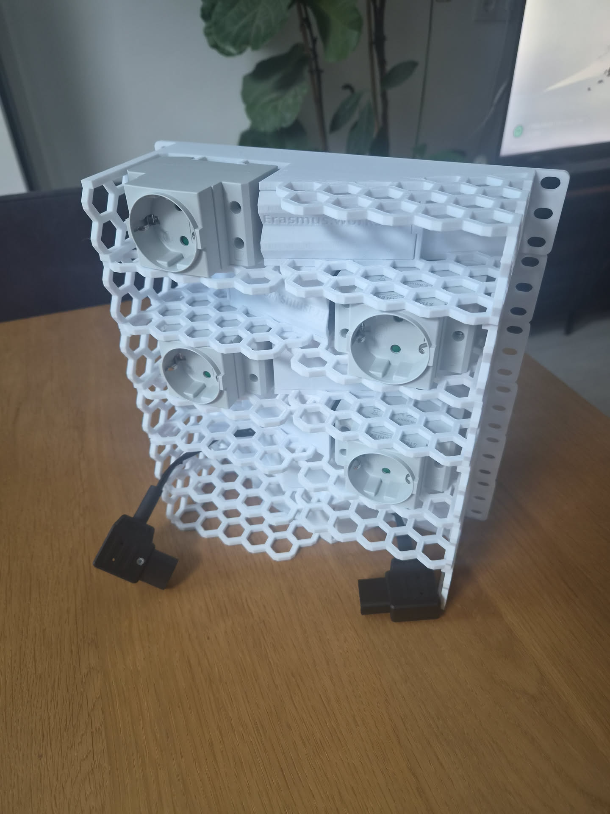
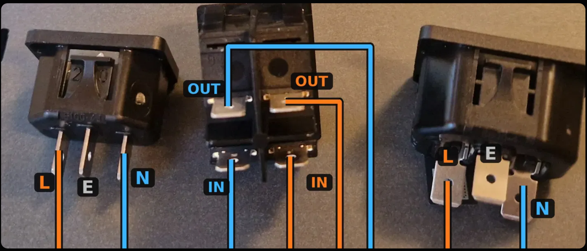
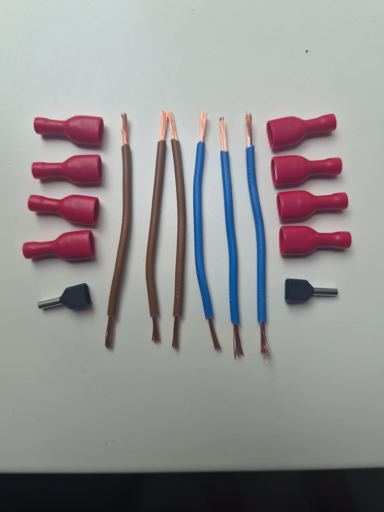
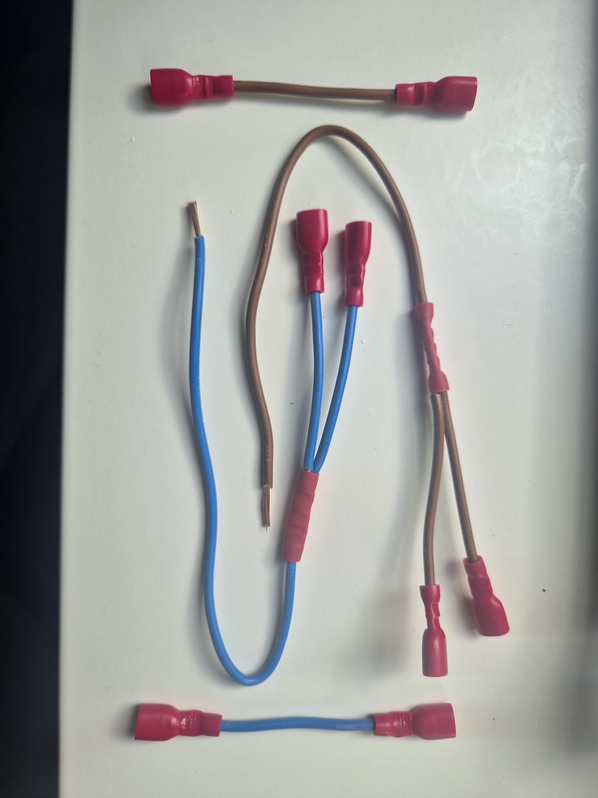
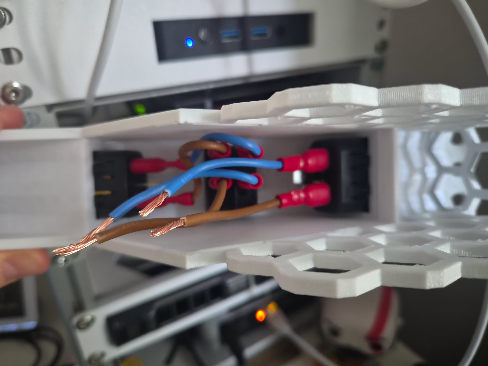

# Rack Power Module

A 10-inch rack part for mains distribution: one switched socket per module,
chained down the back of the rack.

Do not build this without reading [Safety](#safety) first.

## Design notes

These are the modules. Two variants, same face plate: C14 inlet, illuminated
rocker, C13 outlet, and a honeycomb shelf behind it for the mains adapter. A
30 cm C13 to C14 cord links each module to the next.

**Power brick**, the two at the left below: a rewireable right angle C13
connector, straight into the brick's C14 inlet.

**DIN rail**: a socket on a length of DIN rail, for a normal two pin wall
plug.

<table>
<tr>
<td width="50%"></td>
<td width="50%"></td>
</tr>
</table>

Stacked, the sockets alternate left and right. A rack unit is 44.5 mm and some
wall plugs are taller than that, so the offset leaves room for a big one.

Both print files include a cable clip, a fork that pushes into the honeycomb.
Roll the slack up and hold it there.

## Hardware

Per module:

| Qty | Part | Price | Mounting |
| --- | --- | --- | --- |
| 1 | [C13 to C14 cord, 30 cm](https://nl.rs-online.com/web/p/power-cords/1373334) (RS 1373334) | €4.95 | |
| 1 | [C14 inlet, snap-in](https://nl.rs-online.com/web/p/iec-connectors/5392023) (Schurter 6100.4320) | €1.15 | 27.5 × 20.0 mm cutout |
| 1 | [C13 outlet, snap-in](https://nl.rs-online.com/web/p/iec-connectors/5392152) (Schurter 6600.4315) | €2.15 | 32.5 × 24.8 mm cutout |
| 1 | [Illuminated DPST rocker](https://nl.rs-online.com/web/p/rocker-switches/7932507) (Molveno SX82) | €1.75 | 30 × 22 mm cutout |
| 8 | [Female faston, insulated, 0.5 to 1.5 mm²](https://nl.rs-online.com/web/p/spade-connectors/0534339) (RS 534-339) | €1.45 | 6.3 × 0.8 mm tabs |
| 0.6 m | H05VV-F 3G1.5 flexible cable | €0.80 | |
| | **Subtotal** | **€12.25** | |

Plus, per variant:

| Variant | Part | Price | Total |
| --- | --- | --- | --- |
| DIN rail | [DIN rail socket](https://stromzähler.eu/detail/018af08cc9277014a5bf7629857d9ec8) (B+G E-Tech) + 2 × [twin ferrule](https://nl.rs-online.com/web/p/bootlace-ferrules/1788742) (RS 178-8742) | €3.85 | €16.10 |
| Power brick | [C13 rewireable, right angle](https://nl.rs-online.com/web/p/iec-connectors/2825502) (RS 282-5502) + 2 × [butt splice](https://nl.rs-online.com/web/p/splice-connectors/2707457) (RS 270-7457) | €5.48 | €17.73 |

## Want to build this yourself?

1. Download the [print files](#files) and print what you need.
2. Star this repo ⭐
3. Clip in the C13 and C14 connectors, 2 prongs facing away from the face plate.
4. Alternate the rocker per module to keep every switch facing the same way.
5. Wire it up as in [Wiring](#wiring).
6. Clip in and wire up the DIN rail socket or the C13 plug.
7. Clip in the closing plates, short one first. Spread the honeycomb if it sticks.

## Wiring

Do not build this without reading [Safety](#safety) first.

Live and neutral both break at the rocker.

Run live and neutral from the inlet to the rocker and nowhere else. Socket and
outlet both come off the switched side, so the rocker cuts this module and
everything downstream.

The socket splits off after the rocker: at the socket on the DIN rail variant,
two wires into one twin ferrule; mid lead on the power brick variant, at a butt
splice.

<table>
<tr>
<td width="50%"></td>
<td width="50%"></td>
</tr>
<tr>
<td><em>DIN rail loom. Cut all six leads to 8 cm. Twin ferrules at the socket.</em></td>
<td><em>Power brick loom. Cut four leads to 8 cm and one to about 16 cm. Butt splices for the split.</em></td>
</tr>
</table>

Wired up, before the variant-specific parts go in, it looks like this.

## Printing

254 × 90 × 98 mm. The mounting ears take 1U at the rails.

Printed in white PLA. Read [Safety](#safety) before picking a filament.

## Tools

- 3D printer
- Wire stripper and crimper
- Side cutters
- Long nose pliers
- Screwdriver
- Insulation tape

## Files

Same mesh in both formats. Print either.

| Variant | Files |
| --- | --- |
| DIN rail | [3MF](erasmus-works-power-module-din-rail-v62.3mf) · [STL](erasmus-works-power-module-din-rail-v62.stl) |
| Power brick | [3MF](erasmus-works-power-module-power-brick-v62.3mf) · [STL](erasmus-works-power-module-power-brick-v62.stl) |

## Safety

This part carries live mains. Mains wiring kills people who get it wrong, and a
fault in a printed enclosure can start a fire.

Do not build it unless you are competent to wire mains and permitted to do so
where you live. Sleeve or shroud all live terminals.
PLA softens around 60 °C, PETG around 80 °C. Neither is flame retardant. Only a
UL 94 V-0 filament is.

Wire the protective earth if anything you plug in needs it.

Build it at your own risk. I take no responsibility for injury, death, fire, or
damage resulting from anything in this repository.

## License

Star ⭐ this repo if you found it useful.

[CC BY-NC-SA 4.0](../../LICENSE). Use it, modify it, share it, as long as you
credit Andre Erasmus, link back to this repo, keep it non-commercial, and
license anything you share under the same terms.

This work is offered as is, WITHOUT WARRANTIES OR CONDITIONS OF ANY KIND,
express or implied. Please see the licence for applicable conditions.

Source location: https://github.com/ErasmusAndre/mini-rack
